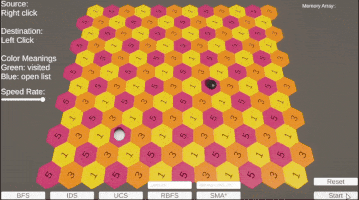
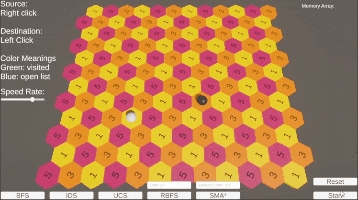
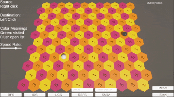

# Unity Hexagonal Pathfinding Algorithms

This project implements various pathfinding algorithms on a hexagonal map in Unity. Each algorithm visualizes the process step by step, demonstrating how nodes are visited and paths are determined.

## Features
- **Hexagonal Map:** Nodes are arranged in a hexagonal grid.
- **Visualized Pathfinding:** Algorithms visually demonstrate their steps with a customizable speed rate.
- **Implemented Algorithms:**
  - Breadth-First Search (BFS)
  - Iterative Deepening Search (IDS)
  - Uniform Cost Search (UCS)
  - Recursive Best-First Search (RBFS)
  - Simplified Memory-Bounded A* (SMA*)

## Requirements
- Unity 2021.3 or newer
- TextMeshPro package

## How to Run
1. Clone this repository.
2. Open the project in Unity.
3. Play the scene to see the pathfinding algorithms in action.
4. Select the desired algorithm in the UI dropdown.

## Visualizations
Below are the visualizations of each algorithm:

### Breadth-First Search (BFS)

### Iterative Deepening Search (IDS)

### Uniform Cost Search (UCS)

### Recursive Best-First Search (RBFS)

### Simplified Memory-Bounded A* (SMA*)

## Customization
- **Speed Rate:** Adjust the visualization speed for algorithms in the UI Menu.
- **Limit:** F limit for RBFS algorithm in the UI Menu.
- **Memory Limit:** Memory node limit for SMA* algorithm in the UI Menu.

## Contributing
Feel free to submit issues, fork the repository, and create pull requests. Contributions are welcome!

## License
This project is licensed under the MIT License. 

## Contact
For any inquiries or suggestions, please contact [mehmedsefakaratas@gmail.com](mailto:mehmedsefakaratas@gmail.com).

